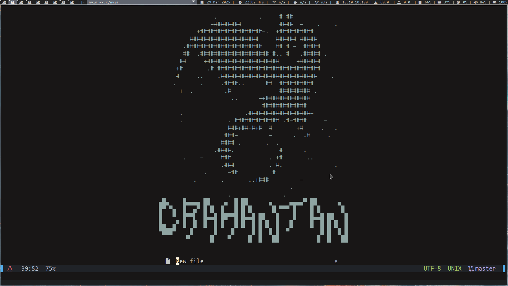

# Configuración Personal de Neovim



Este repositorio contiene mis archivos de configuración personalizados para Neovim, diseñados para optimizar y mejorar la experiencia de edición.

## Estructura del Repositorio

- `init.lua`: Archivo principal de configuración que inicializa y configura los plugins y ajustes personalizados.
- `lua/`: Directorio que contiene módulos Lua adicionales utilizados en la configuración.

## Instalación

1. **Clonar el repositorio:**

   ```sh
   git clone https://github.com/crahantan/nvim-dotfiles.git ~/.config/nvim
   ```

2. **Iniciar Neovim:**

   Al abrir Neovim, los plugins especificados en la configuración se instalarán automáticamente.

## Plugins Utilizados

Los plugins incluidos en esta configuración se encuentran en el directorio `lua/plugins/`. Algunos de ellos son:

- **[nvim-treesitter](https://github.com/nvim-treesitter/nvim-treesitter):** Proporciona resaltado de sintaxis avanzado y mejoras en el parsing del código.
- **[nvim-lspconfig](https://github.com/neovim/nvim-lspconfig):** Configuración para servidores de lenguaje en Neovim.
- **[neotree.nvim](https://github.com/nvim-neo-tree/neo-tree.nvim):** Explorador de archivos avanzado.
- **[mason.nvim](https://github.com/williamboman/mason.nvim):** Gestor de herramientas para LSP, DAP y linters.
- **[lazy.nvim](https://github.com/folke/lazy.nvim):** Administrador de paquetes moderno y eficiente para Neovim.
- **[lualine.nvim](https://github.com/nvim-lualine/lualine.nvim):** Barra de estado altamente personalizable.
- **[cmp-nvim](https://github.com/hrsh7th/nvim-cmp):** Autocompletado avanzado para Neovim.
- **[cmp-buffer](https://github.com/hrsh7th/cmp-buffer):** Fuente de autocompletado basada en el buffer actual.
- **[cmp-path](https://github.com/hrsh7th/cmp-path):** Autocompletado de rutas de archivos.
- **[cmp-cmdline](https://github.com/hrsh7th/cmp-cmdline):** Autocompletado en la línea de comandos de Neovim.
- **[luasnip](https://github.com/L3MON4D3/LuaSnip):** Motor de snippets para Neovim.
- **[comment.nvim](https://github.com/numToStr/Comment.nvim):** Facilita la adición y eliminación de comentarios en el código.
- **[pineapple.nvim](https://github.com/crahantan/pineapple.nvim):** Plugin personalizado para mejorar la productividad en Neovim.

## Atajos de Teclado Personalizados

### Configuración de Teclas

- **Líder (`<leader>`)**: `vim.g.mapleader = ' '`

### Modo Normal

- **`<leader>w`**: Guardar archivo actual (`:write`)
- **`<leader>q`**: Cerrar Neovim (`:quit`)
- **`<leader>e`**: Alternar el explorador de archivos (`:Neotree toggle`)
- **`<leader>l`**: Abrir Lazy (`:Lazy`)
- **`<leader>m`**: Abrir Mason (`:Mason`)
- **`<leader>t`**: Abrir terminal (`:terminal`)
- **`<leader>h`**: Revelar en Neotree (`:Neotree reveal`)
- **`<leader>bn`**: Ir al siguiente buffer (`:bnext`)
- **`<leader>bb`**: Ir al buffer anterior (`:bprevious`)
- **`<leader>bd`**: Cerrar buffer (`:bd`)
- **`<leader>p`**: Ejecutar Pineapple (`:Pineapple`)

## Personalización

Para ajustar esta configuración a tus necesidades:

- **Modificar `init.lua`**: Ajusta los parámetros y opciones según tus preferencias.
- **Editar archivos en `lua/`**: Personaliza módulos específicos para funcionalidades adicionales.

## Contribuciones

Si deseas contribuir a mejorar esta configuración:

1. Realiza un fork del repositorio.
2. Crea una nueva rama (`git checkout -b mejora/tu-mejora`).
3. Realiza tus cambios y haz commit (`git commit -m 'Descripción de la mejora'`).
4. Sube tus cambios (`git push origin mejora/tu-mejora`).
5. Abre un Pull Request detallando tus modificaciones.

## Licencia

Este proyecto está bajo la licencia MIT. Consul
